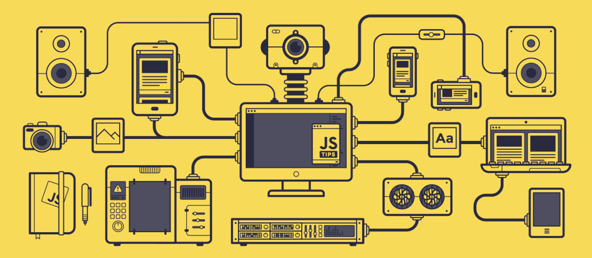

# README Template

<!-- PROJECT LOGO -->
 

  

  <h3 align="center">20 Hands-On JS Project</h3>

  20 Hands-On JavaScript Projects Craft Dynamicaly in HTML, CSS & JavaScript

 

---

 

  

 
 

<!-- TABLE OF CONTENTS -->

  
Table of Contents

  <ol>
    <li>
      <a href="#about-the-project">About The Project</a>
      <ul>
        <li><a href="#built-with">Built With</a></li>
        <li><a href="#other-components">Other Components</a></li>
      </ul>
    </li>
    <li>
      <a href="#getting-started">Getting Started</a>
    </li>
    <li><a href="#road-map">Road Map</a></li>
  </ol>

 
 

---

## About The Project

20 Web Projects with HTML, CSS, and JavaScript

Unlock the Secrets of Web Development Magic with 20 Days, 20 Projects! Embark on an exciting journey to master HTML, CSS, and JavaScript as you craft more than 20 stunning web projects and templates. Elevate your skills, customize your portfolio, and position yourself as an in-demand developer in this comprehensive course.

 

The Project Lineup:

1. Background Animation: Create captivating background animations to add visual intrigue to your web projects.

2. Jumping Letters: Develop a fun and dynamic effect with letters that jump, bringing a playful touch to your website.

3. Bell Notification: Craft a notification system using bells, enhancing user engagement and interaction.

4. Scrollbar Indicator: Implement a stylish indicator to enhance the user experience while scrolling through content.

5. Captcha Generator: Build a dynamic Captcha generator for enhanced security and user verification.

6. JavaScript Tabs Preview: Develop an interactive tab preview system using JavaScript for seamless navigation.

7. Simple Password Generator: Create a tool that generates secure and unique passwords, prioritizing user data protection.

8. Illumination Project: Design an illumination project, exploring creative ways to use light effects in web development.

9. Scratch Effect: Add a unique scratch effect to your projects, providing an innovative and memorable user experience.

10. Disco Light Effect: Implement a disco light effect, adding a touch of excitement and dynamism to your website.

11. Search Box: Build a stylish and functional search box, optimizing user search experiences.

12. GitHub Contribution Clone: Create a project emulating the GitHub contribution graph, showcasing your coding activity.

13. Rotating Animation: Develop a rotating animation, adding a visually appealing dynamic to your web projects.

14. Currency Stack: Design a visual representation of currency stacking, perfect for financial or business-themed websites.

15. Scrolling Images: Implement scrolling images for a sleek and interactive user interface.

16. Digital Clock: Build a digital clock project, showcasing your mastery of time-related functionalities.

17. Vowel Counter: Create a tool that counts vowels, offering a practical application of JavaScript logic.

18. The Popover: Create a popover component for enhanced user interaction, improving the accessibility of additional information.

19. Unicode Char Detector: Develop a tool to detect Unicode characters, adding versatility to your projects.

20. To-Do Application: Build a practical and user-friendly to-do application, perfect for organizational purposes.

 

### Built With

[![HTML][HTML.com]][HTML-url] [![CSS][CSS.com]][CSS-url] [![Javascript][Javascript.com]][Javascript-url]

(<a href="#readme-top">back to top</a>)

---

 

## Getting Started

The Project is in 20 different folders, each folder contains a project.

You can check each project by opening the `index.html` file in each folder.

(<a href="#readme-top">back to top</a>)

---

## Road Map

Future Plans.

 

(<a href="#readme-top">back to top</a>)

<!-- Frameworks -->
[JavaScript.com]: https://img.shields.io/badge/JavaScript-F7DF1E?style=for-the-badge&logo=javascript&logoColor=black
[JavaScript-url]: https://www.javascript.com/
[Html.com]: https://img.shields.io/badge/HTML5-E34F26?style=for-the-badge&logo=html5&logoColor=white
[Html-url]: https://html.com/
[Css.com]: https://img.shields.io/badge/CSS3-1572B6?style=for-the-badge&logo=css3&logoColor=white
[Css-url]: https://www.w3.org/Style/CSS/Overview.en.html